# BKK Coffee Corner

— SCREENSHOT OF RESPONSIVE SCREEN —


**Welcome to BKK Coffee Corner!!**

**BKK Coffee Corner** is the community platform where coffee lovers can find local coffee shops and cafes, read and leave reviews, post anything’s coffee in forums and so on. The site owner can gather data on local coffee shops trends and support local commerce. This project could create a thriving community of coffee lovers and provide value to users and the site owner.
Whether you have a deep passion for coffee or simply savor the cozy atmosphere of a café, you'll find friends here. So, settle into a comfy chair, grab a cup of coffee, and join the conversation. Share your coffee experiences, post pictures, and engage with fellow enthusiasts.☕️🌍📸


— CONTENT SECTION —

## CONTENTS

- [UX - User Experience](#ux)

  - [Colours Theme](#colours-theme)
  - [Typography](#typography)
  - [Wireframes](#wireframes)
  - [Data Schema](#data-schema)
  - [User stories](#user-stories)
  - [Agile Development](#agile-development)

- [Features](#features)

  - [Navigation Bar](#navigation-bar)
  - [Home page](#home-page)
  - [About us page](#about-us-page)
  - [Cafe Details page](#cafe-details-page)
  - [Community page](#community-page)
  - [Sign up page](#sign-up-page)
  - [Sign in page](#sign-in-page)
  - [Contact us page](#contact-us-page)
  - [Notified Pop-up](#notified-pop-up)
  - [The Footer](#the-footer)
  - [Custom Error Handler page](#custom-error-handler-page)
  - [Features left to implement](#features-left-to-implement)

- [Testing](#testing)

- [Deployment & Local deployment](#deployment-&-Local-deployment)

  - [Deployment](#deployment)
  - [Local Deployment](#local-deployment)

- [Credits](#credits)
  - [Content](#contents)
  - [Media](#media)
  - [Code](#code)
  - [Acknowledgments](#acknowledgments)

## UX

### User’s Goal

Users want to discover new coffee shops and cafes in their local area, read reviews, find opening hours, and explore what each venue has to offer. They seek a platform that provides detailed information, user-generated content, and an easy way to plan visits.

### Owner’s Goal

The site owner aims to build a comprehensive list of local coffee shops and cafes, attracting coffee enthusiasts who frequently visit the site. By providing this service, the owner can gather valuable data on coffee shop trends, promote their own favorite cafes, and potentially monetize through partnerships, sponsored listings, or advertisements.

### Colours Theme

The BKK Coffee Corner page is a user-friendly website and it's about coffee! so the main colours I chose are brown and beige, warm and invited tones. I used Maroon color for buttons to make it outstanding. Moreover, I used [WebAIM:Contrast Checker](https://webaim.org/) to check the contrast of my colours to ensure they are easy to read for users.


### Typography

I used [League Spartan](https://fonts.google.com/specimen/Poppins) pairing with [Lora](https://fonts.google.com/specimen/Poppins) because Lora contrasts nicely with the bold, modern look of Spartan. The elegant and traditional feel complements strong contemporary aesthetic combination two fonts creates visually appealing harmonious design.

Additionally, I use [Font Awesome](https://fontawesome.com/) for icons to make the site casual and friendly and for my social media icons in the footer to help users quickly and easily identify my social media sites.

### Wireframes

[Homepage 1](/documentation/wireframe/homepage1.png)

[Homepage 2](/documentation/wireframe/homepage2.png)

[About page](/documentation/wireframe/about-page.png)

[Cafe Details page](/documentation/wireframe/cafe-detail-page.png)

[Review page](/documentation/wireframe/review-page.png)

[Forum page](/documentation/wireframe/forum-page.png)

[Forum Details page](/documentation/wireframe/forum-detail-page.png)

[Contact page](/documentation/wireframe/contact-page.png)

[Mobile Screen pages](/documentation/wireframe/mobile-screen.png)

### Data Schema

The data schema for the BKK Coffee Corner website is structured using a relational model, as illustrated in the Entity Relationship Diagram (ERD) provided. Below is an Entity Relationship Diagram that shows the key models and their fields:

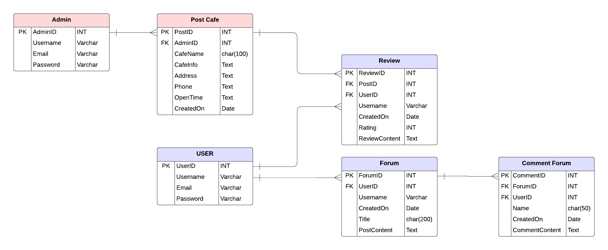

### User stories

1. As a new user, I can create an account so that I can access the cafe's community features, reviews, posts and comments.
2. As a site visitor, I can click on the Community page so that I can read topics and see what the trends are on the site.
   3.As a site visitor, I can click on the About link so that I can read about the site.
3. As a site visitor, I can use the 'Contact Us' feature to get in touch with the admin of the page so that I can ask questions or provide feedback.
4. As a member, I can sign in to the webpage so that I can access my account and enjoy customized features and contents.
5. As a community member, I can participate in forum discussions so that I can share ideas, ask questions, and engage with other cafe enthusiasts.
6. As an Admin of the page I can edit the About content so that the content stays updated with the previous information.
7. As an admin I can manage posts on the site so that the cafes and coffee shop information stay updated and accurate.

User Stories and Acceptance Criteria help me ensure each feature meets the desired functionality and user experience.

### Agile Development

This project was designed using Agile methodology, utilising the Project Board and Issues sections in GitHub

- [Project Board](https://github.com/users/Chatlada-Nina/projects/8/views/1)

## Features

### Navigation Bar

- The full responsive navigation bar includes the BKK Coffee Corner logo that link to the Home page, About us, Community, Contact, Register and Login page and is identical on each page to allow users for easy navigation at all time.

- The pictures below show the Navigation bar in different actions on the page.

Navigation bar:<br>
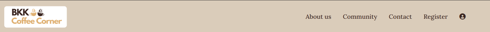

Navigation bar when user is logged in:<br>
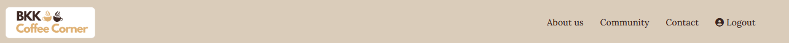

Dropdown navigation menu on mobile screen size:<br>
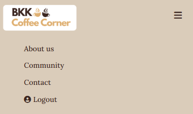

### Home Page

- The Home Page serves as an inviting introduction to the BKK Coffee Corner with a captivating image and a clear call-to-action button "Join us" leading to the sign-up page. The Cafes reviews section displays in cards that preview a picture of a cafe, Cafes name,an excerpt and read reviews link keeping content fresh and engaging for all visitors. The sticky navigation bar follows along when the user scrolls down offering easy navigation across the site at all times.

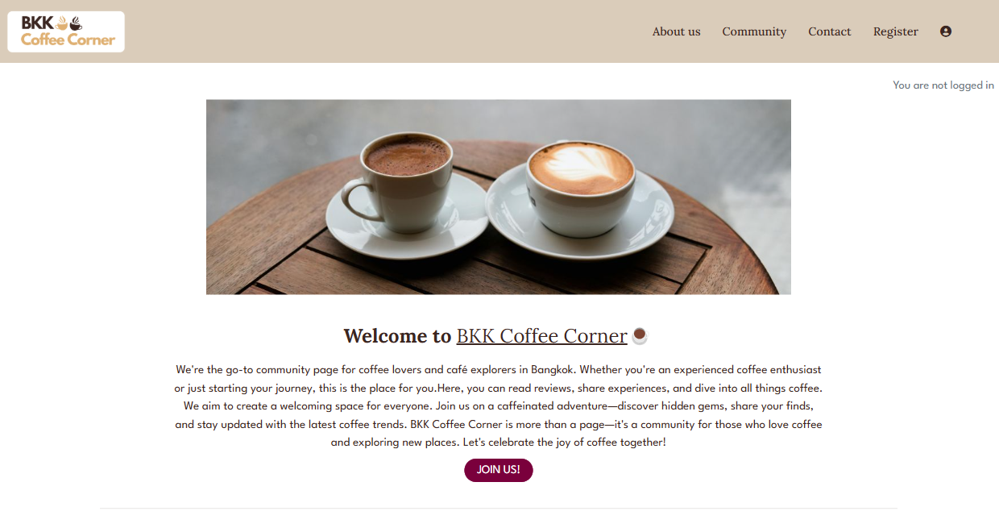

- This Cafe reviews section is a part of the home page that shows all the cafes the site has updated. Every card included an image, cafe's name,an excerpt and a Read reviews button to navigate to the Cafe details and reviews page if the users want to read or write reviews immediately.

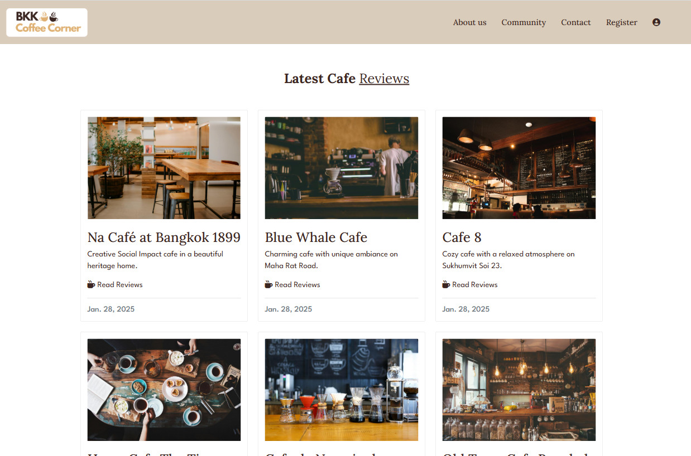

### About Us Page

- The About Us page introduces The BKK Coffee Corner goals, explaining the importance of community and knowledge-sharing for coffee enthusiasts and anyone who loves exploring new cafes and coffee shops in Bangkok. It helps new users understand the site's goals and encourages them to join.

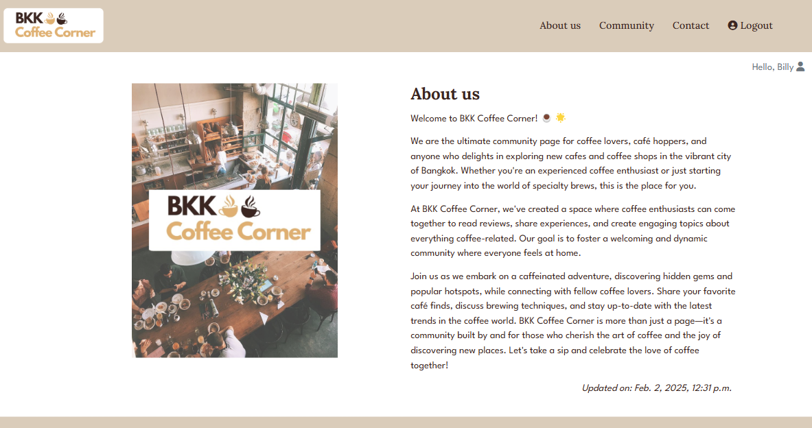

### Cafe Details Page

- The cafe details page shows the full information about the cafe and its reviews. The carousel shows cafe's images, Cafe's name, Cafe's description, Address, phone number and opening time for users who want to plan visiting that cafe.

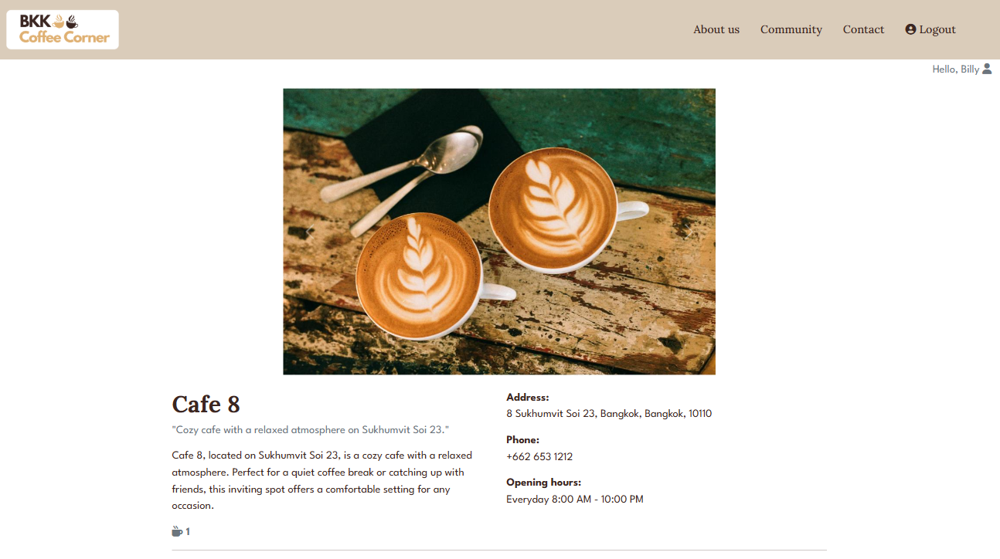

### Cafe Details-reviews Page

- This cafe reviews section is a part of the cafe details page, this allows the new and old users to feel more confident to decide to visit the cafe. The customer review section is simple but concise, it shows user name, review date, rating and review. I make the reviews visible for everyone; however, only members can write the review.

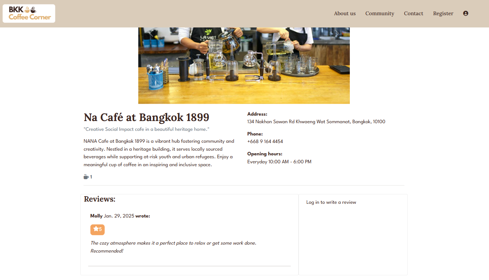

- When you are logged in as a member, you will be able to perform "CRUD Operations" Create, Read, Update and Delete your reviews.

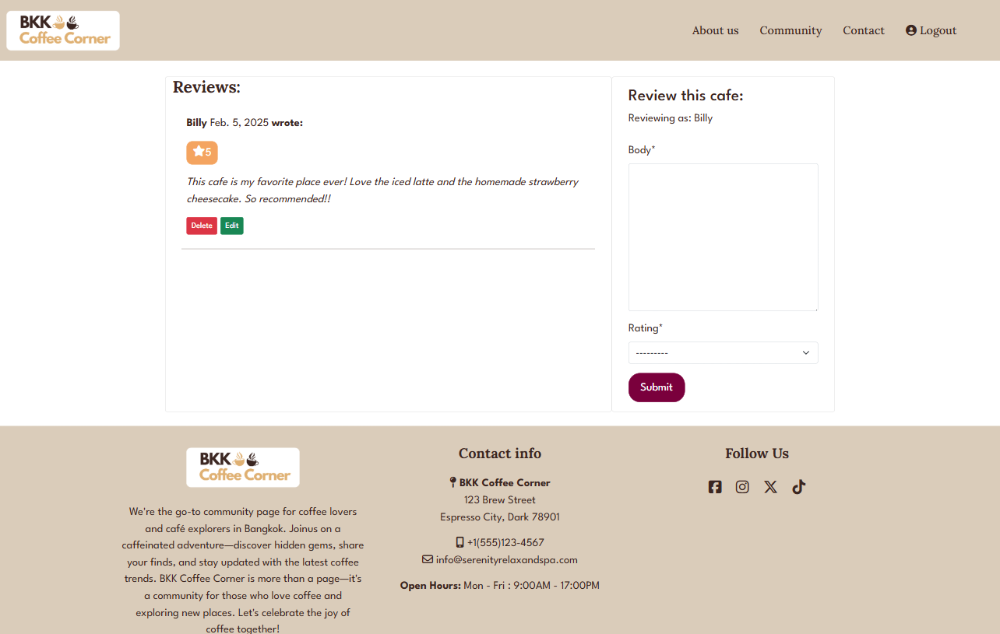

### Community Page

- The community page or Forum page allows users to read or write comments to existing forums or create a new topic. The page shows a title, an author and date where users can click on them and will link to the forum details page. Additionally, there is a link "Create new topic here" on the right side of the page to encourage users to create a new topic as they want.

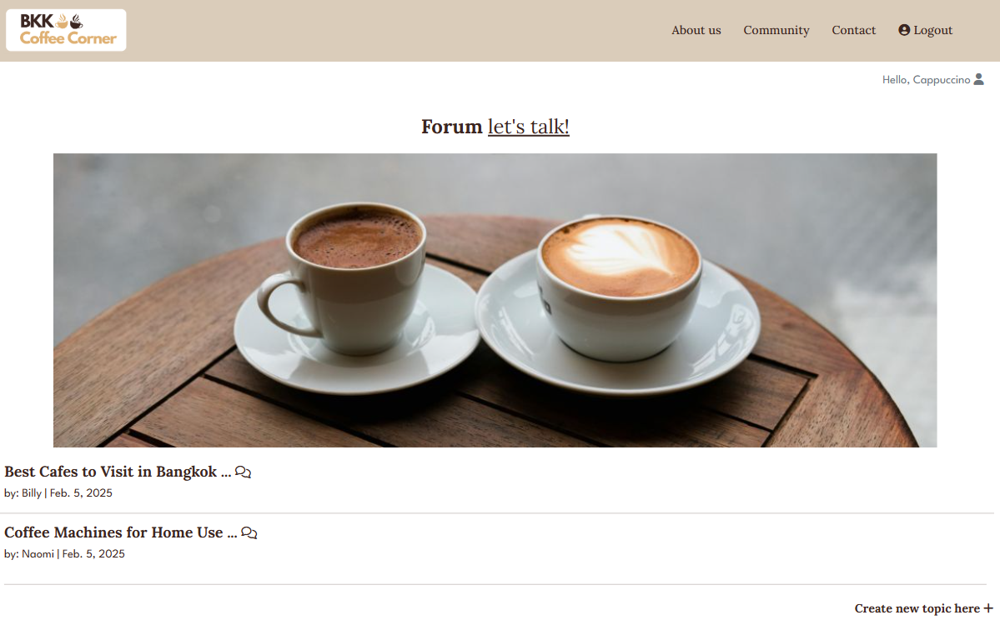

- When you are logged in and clicked on "Create new topic here+" it will direct you to the create Forum Form.

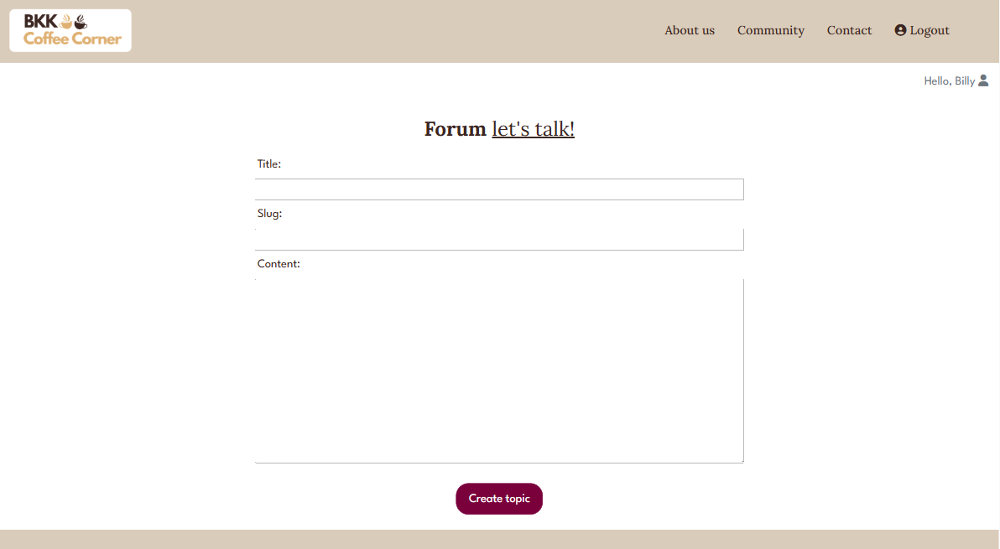

- When you are logged in and you are the author of a forum you will be able to perform "CRUD Operations" Create, Read, Update and Delete your forums the same way as the reviews.

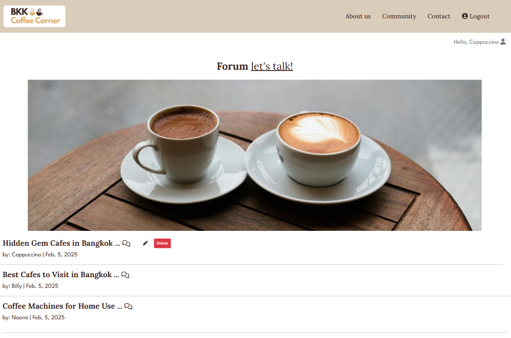

### Sign up Page

- The sign up page includes standard registration fields. Once user is registered, the success pop-up will displayed and user will automatically logged in.

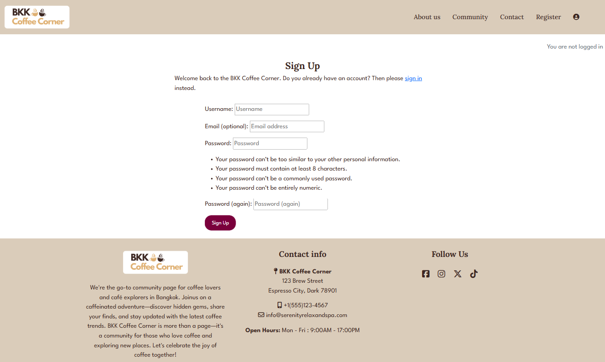

### Sign in Page

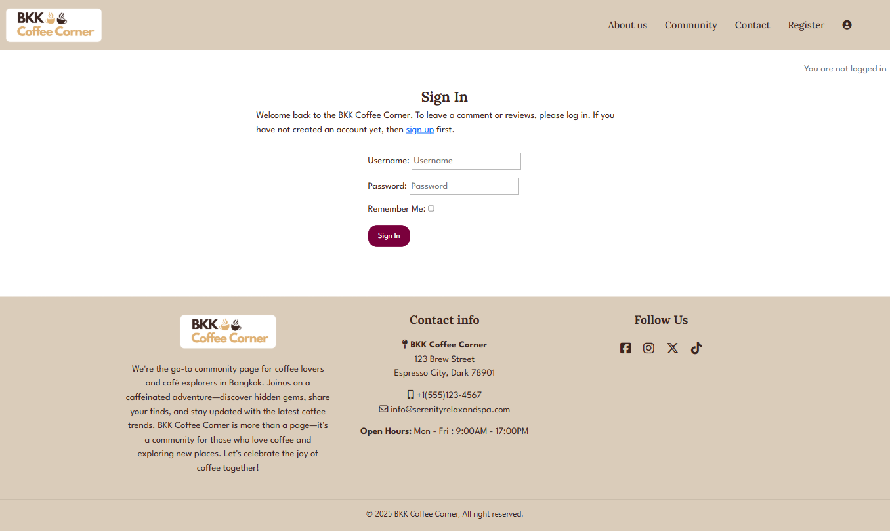

### Sign out Page

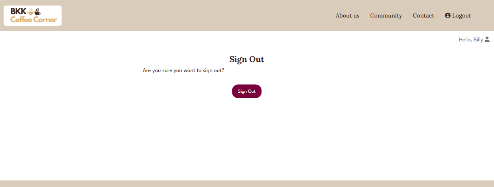

### Contact us Page

- The contact us page provides a direct way for users to contact with feedback or inquiries. Ensure users feel supported and have access to give feedback to the owner site, including inquiry of corporation partners.

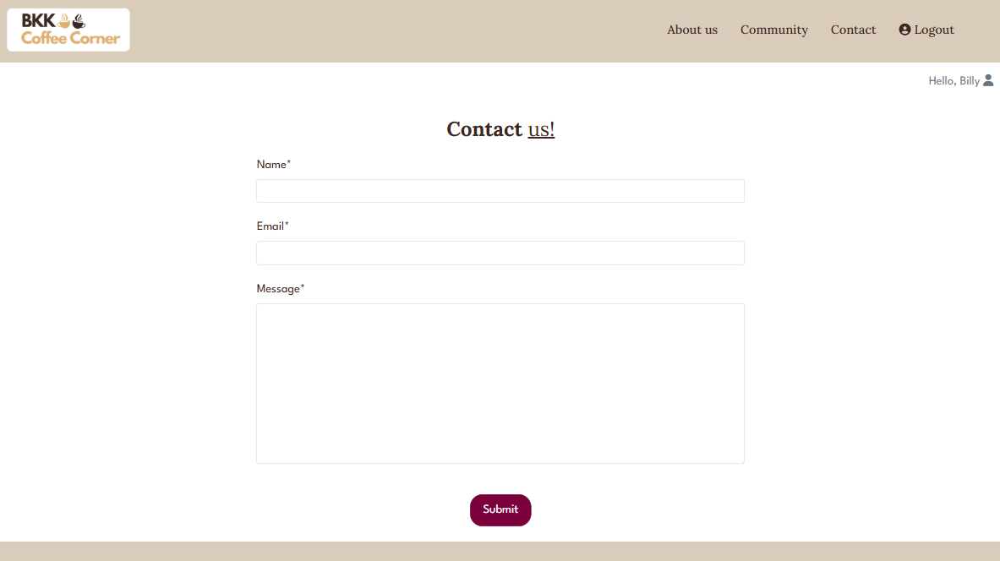

### Notified Pop-up Page

- The notified Pop-up allows users to get a confirmation of each action on the website. When users write a review or edit or delete, the notified pop-up will display to confirm those actions same as in the Forum page.

- A pop-up to inform users that the review or forum is submitted.


- A pop-up to inform users that the review or forum is updated.


- A pop-up to inform users that the review or forum is deleted.


- A pop-up to confirm users if they want to delete the review or forum.


### The Footer Page

- The footer section includes the logo, a brief description, the contact us info, address, phone number, email and social media sites for users.
  The social media links are shown in the icon and when users click on them, they will open in a new tab which makes it easy for the users to keep connected via social media.

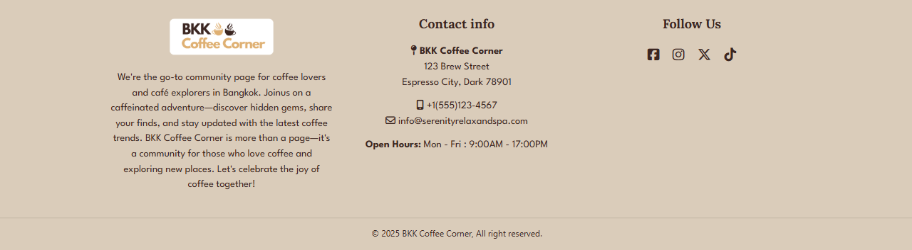

### Custom Error Handler Page

- Custom error page to ensure user-friendly navigation in any unexpected situations.

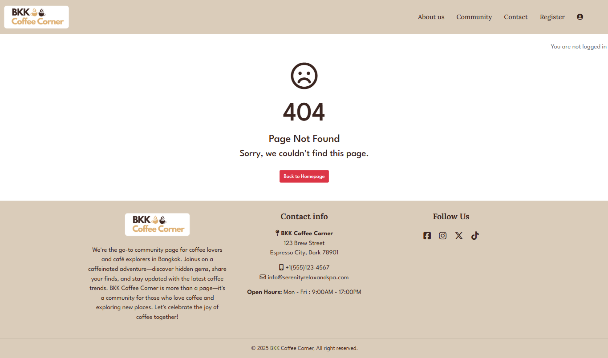

### Features left to implement

## Testing

For all testing, please refer to the [TESTING.md](TESTING.md) file.

### Deployment and Local Deployment

### Deployment

The Live deployed application can be found deployed on [Heroku](https://bkk-coffee-corner-f07d5b0b8233.herokuapp.com/).

### Database

This project uses [Neon.tech](https://www.neon.tech) for the PostgreSQL Database. This was provided by Code Institute via a database-maker website for Code Institute Students.

### Cloudinary API

This project uses the Cloudinary API to store media assets online, due to the fact that Heroku doesn't persist this type of data.

To obtain your own Cloudinary API key, create an account and log in.<br>
On your Cloudinary Dashboard, you can copy your API Environment Variable.<br>
Be sure to remove the CLOUDINARY_URL= as part of the API value; this is the key.

### Local Deployment

This project can be cloned or forked in order to make a local copy on your own system.
For either method, you will need to install any applicable packages found within the _requirements.txt_ file.

- `pip3 install -r requirements.txt`.

You will need to create a new file called `env.py` at the root-level,
and include the same environment variables listed above from the Heroku deployment steps.

Sample `env.py` file:

```python
import os

os.environ.setdefault("CLOUDINARY_URL", "user's own value")
os.environ.setdefault("DATABASE_URL", "user's own value")
os.environ.setdefault("SECRET_KEY", "user's own value")

# local environment only (do not include these in production/deployment!)
os.environ.setdefault("DEBUG", "True")
```

Once the project is cloned or forked, in order to run it locally, you'll need to follow these steps:

- Start the Django app: `python3 manage.py runserver`
- Stop the app once it's loaded: `CTRL+C` or `⌘+C` (Mac)
- Make any necessary migrations: `python3 manage.py makemigrations`
- Migrate the data to the database: `python3 manage.py migrate`
- Create a superuser: `python3 manage.py createsuperuser`
- Load fixtures (if applicable): `python3 manage.py loaddata file-name.json` (repeat for each file)
- Everything should be ready now, so run the Django app again: `python3 manage.py runserver`

#### Forking repo on GitHub

By forking the GitHub Repository we make a copy of the original repository on our GitHub account to view and/or make changes without affecting the original repository by using the following steps...

1. Log in to GitHub and locate the [GitHub Repository](https://github.com/)
2. At the top of the Repository (not top of page) just above the "Settings" Button on the menu, locate the "Fork" Button.
3. You should now have a copy of the original repository in your GitHub account.

#### Making a Local Clone

1. Log in to GitHub and locate the [GitHub Repository](https://github.com/)
2. Under the repository name, click "Clone or download".
3. To clone the repository using HTTPS, under "Clone with HTTPS", copy the link.
4. Open Git Bash
5. Change the current working directory to the location where you want the cloned directory to be made.
6. Type `git clone`, and then paste the URL you copied in Step 3.

```
$ git clone https://github.com/YOUR-USERNAME/YOUR-REPOSITORY
```

7. Press Enter. Your local clone will be created.

```
$ git clone https://github.com/YOUR-USERNAME/YOUR-REPOSITORY
> Cloning into `CI-Clone`...
> remote: Counting objects: 10, done.
> remote: Compressing objects: 100% (8/8), done.
> remove: Total 10 (delta 1), reused 10 (delta 1)
> Unpacking objects: 100% (10/10), done.
```

### Heroku Deployment

The application was deployed to Heroku. In order to deploy, the following steps were taken:

1. If you have an account, login to Heroku. Otherwise create a new account.
2. Once signed in, click the "New" button in the top right corner, below the header and choose "Create new app".
3. Choose a unique name for the application and select your region. When done, click "Create app".
4. This brings you to the "Deploy" tab. From here, click the "Settings" tab and scroll down to the "Config Vars" section and click on "Reveal Config Vars" and set your environment variables.

| Key                     | Value                                                                |
| ----------------------- | -------------------------------------------------------------------- |
| `CLOUDINARY_URL`        | user's own value                                                     |
| `DATABASE_URL`          | user's own value                                                     |
| `DISABLE_COLLECTSTATIC` | 1 (_this is temporary, and can be removed for the final deployment_) |
| `SECRET_KEY`            | user's own value                                                     |

Heroku needs two additional files in order to deploy:

- requirements.txt
- Procfile

You can install this project's **requirements** (where applicable) using:

- `pip3 install -r requirements.txt`

If you have your own packages that have been installed, then the requirements file needs updated using:

- `pip3 freeze --local > requirements.txt`

The **Procfile** can be created with the following command:

- `echo web: gunicorn app_name.wsgi > Procfile`
- _replace **app_name** with the name of your primary Django app name; the folder where settings.py is located_

For Heroku deployment, follow these steps to connect your own GitHub repository to the newly created app:

Either:

- Select **Automatic Deployment** from the Heroku app.

Or:

- In the Terminal/CLI, connect to Heroku using this command: `heroku login -i`
- Set the remote for Heroku: `heroku git:remote -a app_name` (replace _app_name_ with your app name)
- After performing the standard Git `add`, `commit`, and `push` to GitHub, you can now type:
  - `git push heroku main`

The project should now be connected and deployed to Heroku!

## Credits

### Content

- The font styles in the BKK Coffee Corner website were taken from Google Fonts [Lora](https://fonts.google.com/specimen/Lora) and [League Spartan](https://fonts.google.com/specimen/League+Spartan)
- The icons in the website were taken from [Font Awesome](https://fontawesome.com/)
- Wireframes I have created in [Canva](https://canva.com/)
- The description and information of cafes and the about us were modified from [Microsoft Copilot](https://copilot.microsoft.com/)
- The reviews and comments texts were modified by myself.
- The Modal of confirmation was learned and modified from I Think Therefore I blog: CI learning platform.
- Modified and combined components methods from documentations and tutorials on CI learning platform, [W3Schools](https://w3Schools.com/), [MDN Web Docs](https://developer.mozilla.org/en-US/) and [StackOverFlow](https://stackoverflow.co/)

### Media

- All images were taken from [Pexels](https://pexels.com/)

### Acknowledgments

I would like to thank you the following people:

- Code Institute Team and the slack community that shared ideas, solutions and inspirations during the journey.
- My partner and my family.
