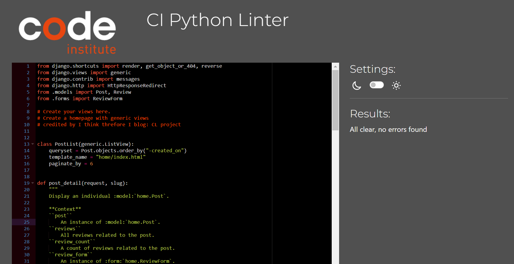
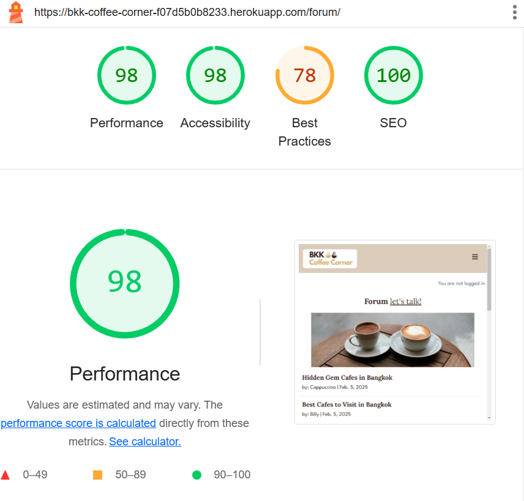

# Testing

Return back to the [README.md](README.md) file.

## Index – Table of Contents

- [HTML](#html)
- [CSS](#css)
- [JavaScript](#javascript)
- [Python](#python)
- [Responsiveness](#responsiveness)
- [Lighthouse](#lighthouse)
- [Defensive Programming](#defensive-programming)

## Code Validation

### HTML

I have used the recommended [HTML W3C Validator](https://validator.w3.org) to validate all of my HTML files.

| Page             | Screenshot                                                                   | Notes                                                                                                                                                                                                                                                                                                                                                                                                                                          |
| ---------------- | ---------------------------------------------------------------------------- | ---------------------------------------------------------------------------------------------------------------------------------------------------------------------------------------------------------------------------------------------------------------------------------------------------------------------------------------------------------------------------------------------------------------------------------------------- |
| Home             |                    | 1.) The error is because the width attribute of the  tag expects a value in pixels not a percentage. To fix this, I used CSS to set the width as a percentage instead. 2.) The trailing slash on void elements has no effect and interacts badly with unquoted attribute values. In HTML5, void elements should not have a trailing slash. To fix this, I have removed the trailing slash and made sure that attribute values are quoted. |
| About            |                       | The error is No p element in scope but a p end tag seen so I fixed this issue by removing the p end tag.                                                                                                                                                                                                                                                                                                                                       |
| Community        |                       | 1.) The error is because the width attribute of the  tag expects a value in pixels not a percentage. To fix this, I used CSS to set the width as a percentage instead. 2.) The Error: Stray end tag div. I fixed this issue by rearranging the div tag on the forum_list.html to make sure the end tag did not stray from the open tag.                                                                                                   |
| Contact Us       |                     | Pass: No Errors                                                                                                                                                                                                                                                                                                                                                                                                                                |
| Forum Details    |                | Pass: No Errors                                                                                                                                                                                                                                                                                                                                                                                                                                |
| Cafe Details     |                | This issue is caused by Django Summernote's inconsistent use of 
 tags when rendering text. To fix this, I changed p tag to article tag so the issue is resolved.                                                                                                                                                                                                                                                                            |
| Comment          |  | Pass: No Errors                                                                                                                                                                                                                                                                                                                                                                                                                                |
| Review           |   | Pass: No Errors                                                                                                                                                                                                                                                                                                                                                                                                                                |
| Create New Forum |              | The validation error arises from the default Django form rendering engine used by allauth, which generates the HTML automatically. Although this issue does not impact functionality, correcting it would require overriding the templates or entirely modifying the form rendering logic.                                                                                                                                                     |
| Login            |                       | Pass: No Errors                                                                                                                                                                                                                                                                                                                                                                                                                                |
| Logout           |                     | The validation error arises from the default Django form rendering engine used by allauth, which generates the HTML automatically. Although this issue does not impact functionality, correcting it would require overriding the templates or entirely modifying the form rendering logic.                                                                                                                                                     |
| Signup           |                      | The validation error arises from the default Django form rendering engine used by allauth, which generates the HTML automatically. Although this issue does not impact functionality, correcting it would require overriding the templates or entirely modifying the form rendering logic.                                                                                                                                                     |

### CSS

I have used the recommended [CSS Jigsaw Validator](https://jigsaw.w3.org/css-validator) to validate all of my CSS file.

| Page       | Screenshot                                                     | Notes           |
| ---------- | -------------------------------------------------------------- | --------------- |
| Contact Us |  | Pass: No Errors |

### JavaScript

I have used the recommended [JShint Validator](https://jshint.com) to validate all of my JS files (the comments.js file, the reviews.js file and the forums.js file). After inserting /_jshint esversion: 6 _/ at the top of the files no errors were returned apart from one undefined variable - bootstrap.

| File        | Screenshot                                                  | Notes                                         |
| ----------- | ----------------------------------------------------------- | --------------------------------------------- |
| comments.js |  | One undefined variable "bootstrap" see below. |
| reviews.js  |   | One undefined variable "bootstrap" see below. |
| forums.js   |    | One undefined variable "bootstrap" see below. |

One undefined variable "bootstrap".

This appears when using Bootstrap's JavaScript components because JSHint doesn't recognize the bootstrap object as a global variable, even though it is defined globally by the included Bootstrap JS file.
This is a common issue with external libraries that define global variables. JSHint doesn't automatically detect these variables unless they are declared in the configuration.

### Python

I have used the recommended [PEP8 CI Python Linter](https://pep8ci.herokuapp.com) to validate all of my Python files. No errors were returned:

#### Validation For Coffee Corner App

| File        | Screenshot                                                               | Notes           |
| ----------- | ------------------------------------------------------------------------ | --------------- |
| asgi.py     |     | Pass: No Errors |
| settings.py |  | Pass: No Errors |
| urls.py     |     | Pass: No Errors |
| views.py    |    | Pass: No Errors |
| wsgi.py     |     | Pass: No Errors |

#### Validation For about App

| File      | Screenshot                                                       | Notes           |
| --------- | ---------------------------------------------------------------- | --------------- |
| admin.py  |   | Pass: No Errors |
| apps.py   |    | Pass: No Errors |
| models.py |  | Pass: No Errors |
| urls.py   |    | Pass: No Errors |
| views.py  |   | Pass: No Errors |

#### Validation For Contact App

| File          | Screenshot                                                             | Notes           |
| ------------- | ---------------------------------------------------------------------- | --------------- |
| admin.py      |       | Pass: No Errors |
| apps.py       |        | Pass: No Errors |
| test_forms.py |  | Pass: No Errors |
| models.py     |      | Pass: No Errors |
| urls.py       |        | Pass: No Errors |
| views.py      |       | Pass: No Errors |

#### Validation For Home App

| File          | Screenshot                                                          | Notes           |
| ------------- | ------------------------------------------------------------------- | --------------- |
| admin.py      |       | Pass: No Errors |
| apps.py       |        | Pass: No Errors |
| test_forms.py |  | Pass: No Errors |
| models.py     |      | Pass: No Errors |
| urls.py       |        | Pass: No Errors |
| views.py      |       | Pass: No Errors |

#### Validation For Forum App

| File          | Screenshot                                                           | Notes           |
| ------------- | -------------------------------------------------------------------- | --------------- |
| admin.py      |       | Pass: No Errors |
| apps.py       |        | Pass: No Errors |
| test_forms.py |  | Pass: No Errors |
| models.py     |      | Pass: No Errors |
| urls.py       |        | Pass: No Errors |
| views.py      |       | Pass: No Errors |

### Responsiveness

- The website has been tested on different devices(under which; iPhone 13 / Samsung Galaxy S9 / MacBook Air / Lenovo laptop).
- The website was responsive on all screens from mobile phones to desktops.
- Chrome DEV Tools have been used to check the responsivness throughout the development of the website.

### Lighthouse

I've audited my deployed project with the Lighthouse tool to identify any significant issues. Overall, I'm pleased with the results. However, it's worth noting that the 'Best Practices' score is notably affected by the Cloudinary images.

| Page          | Size    | Screenshot                                                        |
| ------------- | ------- | ----------------------------------------------------------------- |
| Home          | Desktop |           |
| About         | Desktop |          |
| Forum         | Desktop |          |
| Forum Details | Desktop |  |
| Forum Form    | Desktop |     |
| Cafe Details  | Desktop |   |
| Contact us    | Desktop |      |
| Sign In       | Desktop |         |
| Sign Up       | Desktop |         |

### Defensive Programming

Defensive programming was manually tested with the below user acceptance testing:

| Page                                           | User Action                      | Expected Result                                                        | Pass/Fail | Comments |
| ---------------------------------------------- | -------------------------------- | ---------------------------------------------------------------------- | --------- | -------- |
| **Navigation bar**                             |                                  |                                                                        |           |          |
|                                                | Click on Logo                    | Redirection to Home page                                               | Pass      |          |
|                                                | Click on About us in navbar      | Redirection to About us page                                           | Pass      |          |
|                                                | Click on Community in navbar     | Redirection to Community page                                          | Pass      |          |
|                                                | Click on Contact in navbar       | Redirection to Contact page                                            | Pass      |          |
|                                                | Click on Register in navbar      | Redirection to Sign-up form page                                       | Pass      |          |
|                                                | Click on the user icon in navbar | Redirection to Sign-in page                                            | Pass      |          |
| **Footer**                                     |                                  |                                                                        |           |          |
|                                                | Click on each social media icon  | Redirection to each social media website                               | Pass      |          |
| **Home page**                                  |                                  |                                                                        |           |          |
|                                                | Click on JOIN US! button         | Redirection to Sign-up form page                                       | Pass      |          |
|                                                | Click on Cafe name link          | Redirection to Cafe-details page                                       | Pass      |          |
|                                                | Click on Read Reviews link       | Redirection to Cafe-details page                                       | Pass      |          |
|                                                | Click on Pagination NEXT         | Redirection to next pagination page                                    | Pass      |          |
|                                                | Click on Pagination PREV         | Redirection to previous pagination page                                | Pass      |          |
| **Community page (not logged in)**             |                                  |                                                                        |           |          |
|                                                | Click on a topic link            | Redirection to forum-details page                                      | Pass      |          |
|                                                | Click on create new topic link   | Redirection to sign-up page                                            | Pass      |          |
| **Community page (Logged in as a member)**     |                                  |                                                                        |           |          |
|                                                | Click on a topic link            | Redirection to forum-details page                                      | Pass      |          |
|                                                | Click on create new topic link   | Redirection to new forum form page                                     | Pass      |          |
|                                                | Click on Edit button             | Redirection to the existing forum form page                            | Pass      |          |
|                                                | Click on Delete button           | Delete forum, display confirmation modal with definite delete button   | Pass      |          |
| **Forum Details page (Logged in as a member)** |                                  |                                                                        |           |          |
|                                                | Add text to body field           | add text                                                               | Pass      |          |
|                                                | Click Submit                     | Display comment, display confirmation pop-up "Comment submitted!"      | Pass      |          |
|                                                | Click on Edit button             | Redirection to the existing comment box                                | Pass      |          |
|                                                | Click on Delete button           | Delete comment, display confirmation modal with definite delete button | Pass      |          |
| **Cafe Details page (Logged in as a member)**  |                                  |                                                                        |           |          |
|                                                | Add text to body field           | add text                                                               | Pass      |          |
|                                                | Give rating to rating field      | chose a number                                                         | Pass      |          |
|                                                | Click Submit                     | Display review, display confirmation pop-up "Review submitted!"        | Pass      |          |
|                                                | Click on Edit button             | Redirection to the existing review box                                 | Pass      |          |
|                                                | Click on Delete button           | Delete review, display confirmation modal with definite delete button  | Pass      |          |
