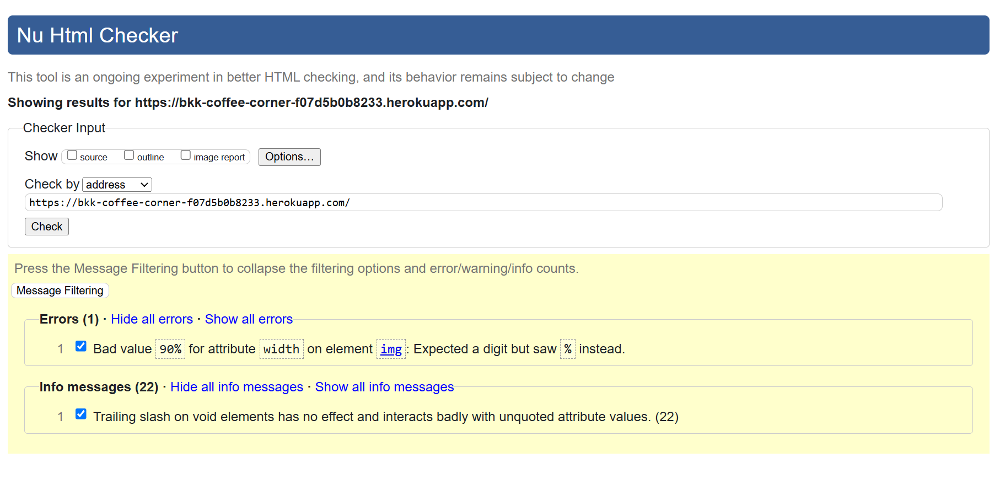
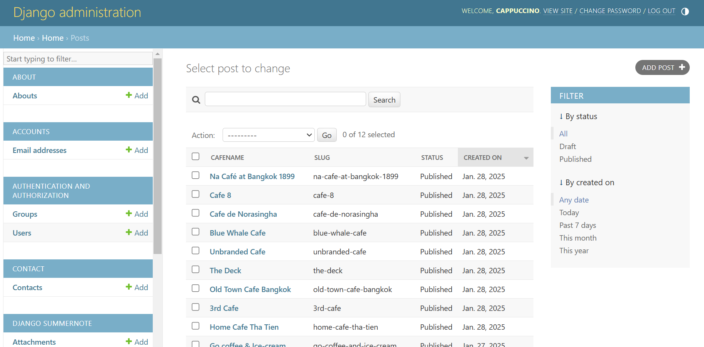

# Testing

Return back to the [README.md](README.md) file.

## CONTENTS

- [AUTOMATED TESTING](#automated-testing)
  - [HTML](#html)
  - [CSS](#css)
  - [JavaScript](#javascript)
  - [Python](#python)
  - [Lighthouse](#lighthouse)
- [MANUAL TESTING](#manual-testing)
  - [Responsiveness](#responsiveness)
  - [Defensive Programming](#defensive-programming)
  - [User Story Testing](#user-story-testing)
- [SOLVED BUGS](#solved-bugs)

## AUTOMATED TESTING

### HTML

I have used the recommended [HTML W3C Validator](https://validator.w3.org) to validate all of my HTML files.

| Page             | Screenshot                                                                   | Notes                                                                                                                                                                                                                                                                                                                                                                                                                                          |
| ---------------- | ---------------------------------------------------------------------------- | ---------------------------------------------------------------------------------------------------------------------------------------------------------------------------------------------------------------------------------------------------------------------------------------------------------------------------------------------------------------------------------------------------------------------------------------------- |
| Home             |                    | 1.) The error is because the width attribute of the  tag expects a value in pixels not a percentage. To fix this, I used CSS to set the width as a percentage instead. 2.) The trailing slash on void elements has no effect and interacts badly with unquoted attribute values. In HTML5, void elements should not have a trailing slash. To fix this, I have removed the trailing slash and made sure that attribute values are quoted. |
| About            |                       | The error is No p element in scope but a p end tag seen so I fixed this issue by removing the p end tag.                                                                                                                                                                                                                                                                                                                                       |
| Community        |                       | 1.) The error is because the width attribute of the  tag expects a value in pixels not a percentage. To fix this, I used CSS to set the width as a percentage instead. 2.) The Error: Stray end tag div. I fixed this issue by rearranging the div tag on the forum_list.html to make sure the end tag did not stray from the open tag.                                                                                                   |
| Contact Us       |                     | Pass: No Errors                                                                                                                                                                                                                                                                                                                                                                                                                                |
| Forum Details    |                | Pass: No Errors                                                                                                                                                                                                                                                                                                                                                                                                                                |
| Cafe Details     |                | This issue is caused by Django Summernote's inconsistent use of 
 tags when rendering text. To fix this, I changed p tag to article tag so the issue is resolved.                                                                                                                                                                                                                                                                            |
| Comment          |  | Pass: No Errors                                                                                                                                                                                                                                                                                                                                                                                                                                |
| Review           |   | Pass: No Errors                                                                                                                                                                                                                                                                                                                                                                                                                                |
| Create New Forum |              | The validation error arises from the default Django form rendering engine used by allauth, which generates the HTML automatically. Although this issue does not impact functionality, correcting it would require overriding the templates or entirely modifying the form rendering logic.                                                                                                                                                     |
| Login            |                       | Pass: No Errors                                                                                                                                                                                                                                                                                                                                                                                                                                |
| Logout           |                     | The validation error arises from the default Django form rendering engine used by allauth, which generates the HTML automatically. Although this issue does not impact functionality, correcting it would require overriding the templates or entirely modifying the form rendering logic.                                                                                                                                                     |
| Signup           |                      | The validation error arises from the default Django form rendering engine used by allauth, which generates the HTML automatically. Although this issue does not impact functionality, correcting it would require overriding the templates or entirely modifying the form rendering logic.                                                                                                                                                     |

### CSS

I have used the recommended [CSS Jigsaw Validator](https://jigsaw.w3.org/css-validator) to validate all of my CSS file.

| Page       | Screenshot                                                     | Notes           |
| ---------- | -------------------------------------------------------------- | --------------- |
| Contact Us |  | Pass: No Errors |

### JavaScript

I have used the recommended [JShint Validator](https://jshint.com) to validate all of my JS files (the comments.js file, the reviews.js file and the forums.js file). After inserting /_jshint esversion: 6 _/ at the top of the files no errors were returned apart from one undefined variable - bootstrap.

| File        | Screenshot                                                  | Notes                                         |
| ----------- | ----------------------------------------------------------- | --------------------------------------------- |
| comments.js |  | One undefined variable "bootstrap" see below. |
| reviews.js  |   | One undefined variable "bootstrap" see below. |
| forums.js   |    | One undefined variable "bootstrap" see below. |

One undefined variable "bootstrap".

This appears when using Bootstrap's JavaScript components because JSHint doesn't recognize the bootstrap object as a global variable, even though it is defined globally by the included Bootstrap JS file.
This is a common issue with external libraries that define global variables. JSHint doesn't automatically detect these variables unless they are declared in the configuration.

### Python

I have used the recommended [PEP8 CI Python Linter](https://pep8ci.herokuapp.com) to validate all of my Python files. No errors were returned:

#### Validation For Coffee Corner App

| File        | Screenshot                                                               | Notes           |
| ----------- | ------------------------------------------------------------------------ | --------------- |
| asgi.py     |     | Pass: No Errors |
| settings.py |  | Pass: No Errors |
| urls.py     |     | Pass: No Errors |
| views.py    |    | Pass: No Errors |
| wsgi.py     |     | Pass: No Errors |

#### Validation For about App

| File      | Screenshot                                                       | Notes           |
| --------- | ---------------------------------------------------------------- | --------------- |
| admin.py  |   | Pass: No Errors |
| apps.py   |    | Pass: No Errors |
| models.py |  | Pass: No Errors |
| urls.py   |    | Pass: No Errors |
| views.py  |   | Pass: No Errors |

#### Validation For Contact App

| File          | Screenshot                                                             | Notes           |
| ------------- | ---------------------------------------------------------------------- | --------------- |
| admin.py      |       | Pass: No Errors |
| apps.py       |        | Pass: No Errors |
| test_forms.py |  | Pass: No Errors |
| models.py     |      | Pass: No Errors |
| urls.py       |        | Pass: No Errors |
| views.py      |       | Pass: No Errors |

#### Validation For Home App

| File          | Screenshot                                                          | Notes           |
| ------------- | ------------------------------------------------------------------- | --------------- |
| admin.py      |       | Pass: No Errors |
| apps.py       |        | Pass: No Errors |
| test_forms.py |  | Pass: No Errors |
| models.py     |      | Pass: No Errors |
| urls.py       |        | Pass: No Errors |
| views.py      |       | Pass: No Errors |

#### Validation For Forum App

| File          | Screenshot                                                           | Notes           |
| ------------- | -------------------------------------------------------------------- | --------------- |
| admin.py      |       | Pass: No Errors |
| apps.py       |        | Pass: No Errors |
| test_forms.py |  | Pass: No Errors |
| models.py     |      | Pass: No Errors |
| urls.py       |        | Pass: No Errors |
| views.py      |       | Pass: No Errors |

### Lighthouse

I've audited my deployed project with the Lighthouse tool to identify any significant issues. Overall, I'm pleased with the results. However, it's worth noting that the 'Best Practices' score is notably affected by the Cloudinary images.

| Page          | Size    | Screenshot                                                        |
| ------------- | ------- | ----------------------------------------------------------------- |
| Home          | Desktop |           |
| About         | Desktop |          |
| Forum         | Desktop |          |
| Forum Details | Desktop |  |
| Forum Form    | Desktop |     |
| Cafe Details  | Desktop |   |
| Contact us    | Desktop |      |
| Sign In       | Desktop |         |
| Sign Up       | Desktop |         |

## MANUAL TESTING

### Responsiveness

Full responsive testing was performed on the following devices:

- Laptop:
  - Macbook Air 2012 13 inch screen
  - Lenovo Ideapad 14 inch screen
- Mobile Devices:
  - IPhone 13
  - Samsung galaxy Note 9

Each device tested the site using the following browsers:

- Google Chrome
- Safari

### Defensive Programming

Defensive programming was manually tested with the below user acceptance testing:

| Page                                           | User Action                                           | Expected Result                                                                 | Pass/Fail | Comments |
| ---------------------------------------------- | ----------------------------------------------------- | ------------------------------------------------------------------------------- | --------- | -------- |
| **Navigation bar**                             |                                                       |                                                                                 |           |          |
|                                                | Click on Logo                                         | Redirection to Home page                                                        | Pass      |          |
|                                                | Click on About us in navbar                           | Redirection to About us page                                                    | Pass      |          |
|                                                | Click on Community in navbar                          | Redirection to Community page                                                   | Pass      |          |
|                                                | Click on Contact in navbar                            | Redirection to Contact page                                                     | Pass      |          |
|                                                | Click on Register in navbar                           | Redirection to Sign-up form page                                                | Pass      |          |
|                                                | Click on the user icon in navbar                      | Redirection to Sign-in page                                                     | Pass      |          |
| **Footer**                                     |                                                       |                                                                                 |           |          |
|                                                | Click on each social media icon                       | Redirection to each social media website                                        | Pass      |          |
| **Home page**                                  |                                                       |                                                                                 |           |          |
|                                                | Click on JOIN US! button                              | Redirection to Sign-up form page                                                | Pass      |          |
|                                                | Click on Cafe name link                               | Redirection to Cafe-details page                                                | Pass      |          |
|                                                | Click on Read Reviews link                            | Redirection to Cafe-details page                                                | Pass      |          |
|                                                | Click on Pagination NEXT                              | Redirection to next pagination page                                             | Pass      |          |
|                                                | Click on Pagination PREV                              | Redirection to previous pagination page                                         | Pass      |          |
| **Community page (not logged in)**             |                                                       |                                                                                 |           |          |
|                                                | Click on a topic link                                 | Redirection to forum-details page                                               | Pass      |          |
|                                                | Click on create new topic link                        | Redirection to sign-up page                                                     | Pass      |          |
| **Community page (Logged in as a member)**     |                                                       |                                                                                 |           |          |
|                                                | Click on a topic link                                 | Redirection to forum-details page                                               | Pass      |          |
|                                                | Click on create new topic link                        | Redirection to new forum form page                                              | Pass      |          |
|                                                | Click on Edit button                                  | Redirection to the existing forum form page                                     | Pass      |          |
|                                                | Click on Delete button                                | Delete forum, display confirmation modal with definite delete button            | Pass      |          |
| **Forum Details page (Logged in as a member)** |                                                       |                                                                                 |           |          |
|                                                | Add text to body field                                | add text                                                                        | Pass      |          |
|                                                | Click Submit                                          | Display comment, display confirmation pop-up "Comment submitted!"               | Pass      |          |
|                                                | Click on Edit button                                  | Redirection to the existing comment box                                         | Pass      |          |
|                                                | Click on Delete button                                | Delete comment, display confirmation modal with definite delete button          | Pass      |          |
| **Cafe Details page (Logged in as a member)**  |                                                       |                                                                                 |           |          |
|                                                | Add text to body field                                | add text                                                                        | Pass      |          |
|                                                | Give rating to rating field                           | chose a number                                                                  | Pass      |          |
|                                                | Click Submit                                          | Display review, display confirmation pop-up "Review submitted!"                 | Pass      |          |
|                                                | Click on Edit button                                  | Redirection to the existing review box                                          | Pass      |          |
|                                                | Click on Delete button                                | Delete review, display confirmation modal with definite delete button           | Pass      |          |
| **Contact Page**                               |                                                       |                                                                                 |           |          |
|                                                | Leave the name input empty and try to click Submit    | A required message popped up                                                    | Pass      |          |
|                                                | Leave the email input empty and try to click Submit   | A required message popped up                                                    | Pass      |          |
|                                                | Leave the message input empty and try to click Submit | A required message popped up                                                    | Pass      |          |
|                                                | Fill in all input correctly and click Submit          | A confirmation message popped up                                                | Pass      |          |
| **Signup Page**                                |                                                       |                                                                                 |           |          |
|                                                | Click sign in link                                    | Redirects user to Login page                                                    | Pass      |          |
|                                                | Leave the name input empty and try to click Submit    | A required message popped up                                                    | Pass      |          |
|                                                | Leave the email input empty and try to click Submit   | This is an optional field, no required message popped up                        | Pass      |          |
|                                                | Enter valid password (twice)                          | Field will only accept password format                                          | Pass      |          |
|                                                | Click on Sign Up button                               | A confirmation message popped up, user is logged in                             | Pass      |
| **Login Page**                                 |                                                       |                                                                                 |           |          |
|                                                | Click sign up link                                    | Redirects user to Sign up page                                                  | Pass      |          |
|                                                | Enter valid username                                  | Field will only accept username format                                          | Pass      |          |
|                                                | Enter valid password                                  | Field will only accept password format                                          | Pass      |          |
| **Log Out**                                    |                                                       |                                                                                 |           |          |
|                                                | Click Logout button                                   | Logs out user, a confirmation message popped up and Redirects user to home page | Pass      |
| **Site buttons and links**                     |                                                       |                                                                                 |           |          |
|                                                | Hover effect buttons                                  | hover effect for buttons across the site the background colour change           | Pass      |
|                                                | Hover effect links                                    | hover effect for links across the site the under-line appear                    | Pass      |
|                                                | Hover effect Social media icons                       | hover effect for Social media icons across the site the colour change           | Pass      |

### User Story Testing

| User Story                                                                                                                                      | Screenshot                                                       |
| ----------------------------------------------------------------------------------------------------------------------------------------------- | ---------------------------------------------------------------- |
| As a new user, I can create an account so that I can access the cafe's community features, reviews post and comments.                           |        |
| As a member, I can sign in to the webpage so that I can access my account and enjoy customized features and contents.                           |        |
| As a cafe visitor, I can write reviews about my experiences at the cafe so that I can provide feedback and help others make informed decisions. |        |
| As a site visitor, I can click on the About link so that I can read about the site.                                                             |      |
| As a site visitor, I can click on the Community page so that I can read topics and see what the trends are on the site.                         |  |
| As a visitor, I can use the 'Contact Us' feature to get in touch with the admin of the page so that I can ask questions or provide feedback.    |     |
| As a community member, I can participate in forum discussions so that I can share ideas, ask questions, and engage with other cafe enthusiasts. |    |
| As an Admin of the page I can edit the About content so that the content stays updated with the previous information.                           |    |
| As an admin I can manage post on the site so that the cafes and coffee shop information stay update and accurate.                               |     |

### Solved Bugs

- During testing the lighthouse This issue "Mixed Content" occured. I have searched on the internet and end up in Slack community where I found the solution. I added `STATICFILES_STORAGE =
'cloudinary_storage.storage.StaticHashedCloudinaryS
torage'` to the settings.py file to ensure `HTTPS` is used instead of `HTTP` and eliminate the console warnings for Cloudinary-hosted images.

- During testing the functionalities on each page, I found that the contact form isn't handled incoming POST request from the contact form. To solve this, I write the POST handler in the view, and save the submitted data to the database. (Followed the steps from Challenge: Handle the form POST request- I Think Therefore I blog from CI learning platform and modified as the site needed.) Lastly, I checked the admin panel to ensure that the contact request has been saved and the confirmation pop-up displayed properly.

- One of my users report that when he clicked Edit button on his review, he must scroll down to see the existing review which makes it not so good UX. To improve this, I have created a JS functionality to make it scroll down automatically when user clicked Edit both on Reviews and comment section.
